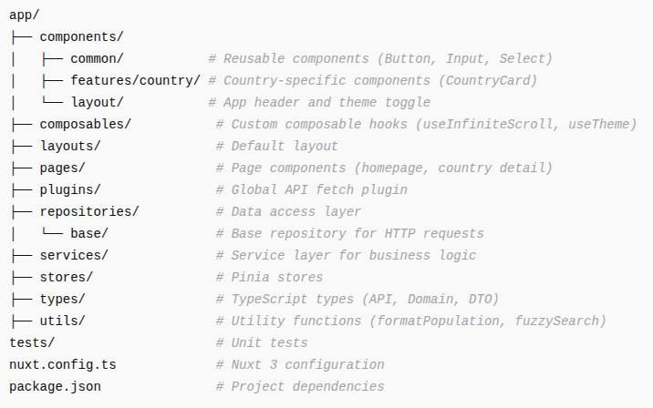

# Journey Mentor – REST Countries API (Nuxt4, Vue 3 Composition API + TypeScript)

**Project Type:** Frontend Coding Challenge
**Tech Stack:** Vue 3, TypeScript, Pinia, Tailwind CSS, Nuxt 4, Vitest, REST Countries API
**Purpose:** Display country data with search, filtering, dark/light mode, and client-side routing

---

## Table of Contents

1. [Project Overview](#project-overview)
2. [Project Management / Kanban Board](#project-management--kanban-board)
3. [Design & Implementation](#design--implementation)
4. [Project Structure](#project-structure)
5. [Features](#features)
6. [Tech & Libraries](#tech--libraries)
7. [Deployment](#deployment)
8. [Additional Notes](#additional-notes)
9. [Code Quality & Workflow](#code-quality--workflow)
10. [Future Improvements / Roadmap](#future-improvements--roadmap)

---

## Project Overview

This project fetches data from the **REST Countries API V2** and displays it in a user-friendly interface, following the provided design files (mobile + desktop, light + dark mode). Users can:

- View all countries on the homepage
- Search for countries by name
- Filter countries by region
- Navigate to detailed country pages
- See and navigate border countries

The project uses **Nuxt 4** for SSR, TypeScript for type safety, and the Composition API for modern, reusable Vue logic.

---

## Project Management / Kanban Board

The project progress, epic, tasks, and issues are tracked using GitHub Projects (Kanban).
You can view all the tasks, open issues, and completed items here:

- **GitHub Repository:** [Journey Mentor Repository](https://github.com/hbsoftco/Journey-Mentor)
- **GitHub Kanban Board:** [Project Board](https://github.com/users/hbsoftco/projects/2)

This board shows the current status of all features, enhancements, and bug fixes, making the development process transparent and organized.

---

## Design & Implementation

- **Responsive Design:** Fully responsive for mobile and desktop
- **Dark/Light Mode:** Custom theme toggler using `useTheme` composable
- **Search:** Supports fuzzy search for approximate country names (e.g., "Grmany" → "Germany")
- **Debounced Search:** Added debounce logic to optimize search performance and reduce API calls
- **Filters:** Users can filter countries by region and sort by population or name
- **Routing:** Client-side routing for country detail pages
- **Lazy Loading:** Implemented for country flags and lists for improved performance
- **Data Caching:** Country data cached to improve speed and reduce redundant API requests
- **Server-Side Rendering:** Ensures content is pre-rendered on the server with fallback handling

---

## Project Structure

**Notes:**

- Clear separation between **repositories**, **services**, and **stores** ensures maintainable and testable code.
- `components/common` vs `components/features` distinguishes **generic reusable UI** vs **domain-specific UI**.

---

## Features

- **Homepage**
  - Display all countries
  - Search & filter by region
  - Sort by name or population
- **Country Detail Page**
  - Shows full country details
  - Border countries clickable for navigation
- **Theme Toggle**
  - Switch between light and dark mode
- **Server-Side Rendering**
  - Pre-renders pages for SEO and performance
- **Lazy Loading**
  - Images and lists loaded progressively

---

## Tech & Libraries

- **Framework:** Vue 3 + Composition API
- **State Management:** Pinia
- **Styling:** Tailwind CSS, custom CSS in `assets/css/main.css`
- **API:** REST Countries V2
- **Routing:** Nuxt 3 file-based routing
- **Testing:** Vitest
- **Utilities:**
  - `fuzzy-search.ts` – for flexible search
  - `format-population.ts` – number formatting

---

## Deployment

The project can be deployed using any **static hosting** or **serverless platform**. Recommended: Vercel or Netlify.

**Demo link:** https://journey-mentor-vercel.hosseinbajan.ir/

---

## Additional Notes

- Fully SSR-enabled with client-side fallback
- Search handles approximate spelling
- Sorting implemented for name and population
- Lazy-loaded country images and lists for performance
- Filters are synced with URL query strings
- Designed for maintainability and scalability using **repository → service → store → component** pattern

---

## Code Quality & Workflow

- **Tailwind CSS v4:** Using the latest version for improved utilities and performance
- **Linting:** Configured with **ESLint** and **lint-staged** to enforce code consistency
- **Commit Standards:** Using **Husky** to enforce **Conventional Commit** messages
- **File Naming Convention:** Enforced **kebab-case** for all file names to maintain uniformity
- **GitHub Actions:** Configured CI workflows to run linting jobs before merges and pull requests

---

## Future Improvements / Roadmap

Planned enhancements for the project:

- **PWA Support** – Make the application a Progressive Web App for offline usage and mobile installability
- **SEO & Lighthouse Enhancements** – Improve SEO and performance scores based on Lighthouse audits
- **Error Handling** – Implement centralized error handling for API calls and UI feedback
- **Sentry Issue Tracking** – Integrate Sentry to monitor and track runtime errors in production
- **Unit Testing Expansion** – Increase test coverage for all components, composables, and services
- **GitHub Actions:** Add CI workflows to run testing jobs before merges and pull requests

These improvements are planned as the next steps to make the project more robust, performant, and production-ready.
